# Data Model Diagram & Entity Relationships

**Version**: 1.0.0 | **Format**: Mermaid ER Diagram

---

## Entity Relationship Diagram

```mermaid
erDiagram
    USER ||--o{ STAGE_TRANSITION : performs
    USER ||--o{ QUALITY_INSPECTION : conducts
    USER ||--o{ AUDIT_LOG_ENTRY : creates
    USER ||--o{ SHIPPING_RECORD : ships

    BATCH ||--o{ STAGE_TRANSITION : has
    BATCH ||--o{ QUALITY_INSPECTION : undergoes
    BATCH ||--o{ DEFECT_RECORD : contains
    BATCH ||--o{ SHIPPING_RECORD : ships
    BATCH ||--o{ AUDIT_LOG_ENTRY : tracked_by
    BATCH ||--o{ PRODUCTION_SHIFT : belongs_to

    QUALITY_INSPECTION ||--o{ DEFECT_RECORD : records
    PRODUCTION_SHIFT ||--o{ BATCH : produces

    USER {
        UUID user_id PK
        string google_email UK "unique per org"
        string full_name
        enum role "WORKER|SUPERVISOR|MANAGER|QUALITY_CONTROLLER|ADMIN"
        enum assigned_stage "nullable, for WORKER role"
        timestamp created_at
        timestamp last_login_at "nullable"
        boolean is_active
        string organization_id
    }

    BATCH {
        string batch_id PK
        enum status "ACTIVE|COMPLETED|REWORKING|REJECTED"
        enum current_stage "PLANNING|MIXING|MOLDING|CURING|FINISHING|QUALITY|PACKAGING|SHIPPING"
        timestamp created_at
        timestamp completed_at "nullable"
        string material_batch_id "nullable, immutable"
        UUID production_shift_id FK "nullable"
        enum priority "LOW|NORMAL|HIGH"
        enum quality_status "PENDING|PASSED|FAILED|CONDITIONAL"
    }

    STAGE_TRANSITION {
        UUID transition_id PK
        string batch_id FK
        enum from_stage
        enum to_stage
        timestamp transitioned_at "immutable"
        UUID completed_by_user_id FK
        integer duration_in_from_stage "seconds, nullable"
        string notes "max 500 chars, nullable"
        integer revision_count "0 if first attempt"
        enum next_stage_readiness "READY|DELAY|HOLD, nullable"
        boolean is_rework
    }

    QUALITY_INSPECTION {
        UUID inspection_id PK
        string batch_id FK "unique"
        timestamp inspection_at
        UUID inspector_id FK
        enum result "PASSED|FAILED|CONDITIONAL"
        integer defect_count
        boolean rework_required
        string rework_steps "nullable, 10-500 chars"
        timestamp approval_timestamp "nullable"
        string notes "max 1000 chars, nullable"
        boolean is_reinspection
    }

    DEFECT_RECORD {
        UUID defect_id PK
        UUID inspection_id FK
        enum defect_type "SURFACE_DEFECTS|DIMENSIONAL_OOT|STRUCTURAL_FAILURE|COLOR_ISSUE|CONTAMINATION|OTHER"
        string location "max 100 chars"
        integer quantity
        integer severity_level "1-5"
        string photo_url "nullable"
        string root_cause_code "nullable"
        timestamp recorded_at
    }

    SHIPPING_RECORD {
        UUID shipping_id PK
        string batch_id FK "unique"
        string destination "max 255 chars"
        string carrier "max 100 chars"
        string tracking_number "nullable, max 100"
        timestamp shipped_at
        date expected_delivery_date
        date actual_delivery_date "nullable"
        UUID shipped_by_user_id FK
        string notes "nullable, max 500"
        string rework_notes "nullable, max 500"
    }

    AUDIT_LOG_ENTRY {
        UUID entry_id PK
        timestamp timestamp "immutable, UTC"
        UUID user_id FK "nullable"
        enum action_type "STAGE_TRANSITION|QUALITY_APPROVAL|BATCH_REVERSAL|DEFECT_RECORDED|EXPORT_INITIATED|ALERT_GENERATED|DATA_IMPORT"
        string affected_batch_id FK "nullable"
        UUID affected_user_id FK "nullable"
        json before_value "nullable"
        json after_value "nullable"
        string reason_for_change "max 500 chars, nullable"
        enum source "MOBILE_APP|DESKTOP_APP|API|SYSTEM"
        string ip_address "nullable"
        json metadata "nullable"
    }

    PRODUCTION_SHIFT {
        UUID shift_id PK
        date date
        enum shift_type "DAY|NIGHT|WEEKEND"
        time start_time
        time end_time
        UUID production_manager_id FK
        UUID supervisor_id FK "nullable"
        integer target_production_count "nullable"
        integer actual_production_count
        string notes "max 1000 chars, nullable"
    }
```



---

## Key Relationships Explained

### 1. User → StageTransition (1:M)
Each user (worker) can perform many stage transitions. Represents who logged each batch completion.

**Index**: `(completed_by_user_id, transitioned_at DESC)` for worker productivity queries

### 2. Batch → StageTransition (1:M)
Each batch goes through multiple stage transitions (8 stages max = 7 transitions + START).

**Index**: `(batch_id, transitioned_at DESC)` for complete batch history/timeline

### 3. Batch → QualityInspection (1:1)
Each batch has max one quality inspection (though inspection record may be updated if reinspected).

**Constraint**: `UNIQUE(batch_id)` on QualityInspection table

### 4. QualityInspection → DefectRecord (1:M)
Each inspection can have multiple defects recorded (e.g., defects in different locations/severity levels).

**Index**: `(inspection_id)` for listing defects for inspection

### 5. Batch → ShippingRecord (1:1)
Each batch has max one shipping record (only for completed batches).

**Constraint**: `UNIQUE(batch_id)` on ShippingRecord table

### 6. User → QualityInspection (1:M)
Each quality controller can conduct many inspections.

**Index**: `(inspector_id, inspection_at)` for QC productivity metrics

### 7. Batch → AuditLogEntry (1:M)
Each batch has many audit events (creation, stage transitions, quality results, reversals, exports).

**Index**: `(affected_batch_id, timestamp DESC)` for audit trail retrieval

### 8. ProductionShift → Batch (1:M)
Each shift can contain multiple batches.

**Index**: `(production_shift_id)` for shift-level reporting

---

## State & Constraint Relationships

### Batch State Machine Validation

```
created_at (PLANNING) 
  ↓ [via StageTransition]
  MIXING 
  ↓
  MOLDING
  ↓
  CURING
  ↓
  FINISHING
  ↓
  QUALITY [awaits QualityInspection]
    ├─ QualityInspection.result = PASSED → PACKAGING
    ├─ QualityInspection.result = FAILED → status = REJECTED
    └─ QualityInspection.result = CONDITIONAL → PACKAGING + rework_required
  ↓
  PACKAGING
  ↓
  SHIPPING [creates ShippingRecord]
    ↓
  completed_at (END)
```

**Constraint**: `batch.completed_at` can only be set when `batch.current_stage = SHIPPING` AND `ShippingRecord` exists for that batch.

### Quality Gate Enforcement

```
StageTransition.to_stage = PACKAGING
  ↓ [implies current batch.current_stage = QUALITY was previous]
  ↓
  Validate: QualityInspection.batch_id = batch_id AND QualityInspection.result IN (PASSED, CONDITIONAL)
  ↓ If validation fails: REJECT transition with error
```

---

## Performance Indexes Summary

**High-Volume Queries** (real-time dashboard):
```sql
-- Index 1: Batches per stage (30s refresh)
INDEX idx_batch_stage ON Batch(status, current_stage, organization_id)

-- Index 2: Production shift metrics
INDEX idx_shift_date ON ProductionShift(date, shift_type)
```

**Medium-Volume Queries** (batch detail, timeline):
```sql
-- Index 3: Stage transition history
INDEX idx_transition_timeline ON StageTransition(batch_id, transitioned_at DESC)

-- Index 4: Audit trail for batch
INDEX idx_audit_batch ON AuditLogEntry(affected_batch_id, timestamp DESC)
```

**Low-Volume Queries** (reports, analytics):
```sql
-- Index 5: Defect analysis
INDEX idx_defect_type ON DefectRecord(defect_type, recorded_at)

-- Index 6: Stage duration analysis
INDEX idx_stage_duration ON StageTransition(from_stage, transitioned_at)
```

---

## Foreign Key Constraints

```sql
-- Batch → ProductionShift
ALTER TABLE Batch
ADD CONSTRAINT fk_batch_shift
FOREIGN KEY (production_shift_id) REFERENCES ProductionShift(shift_id)
ON DELETE RESTRICT;  -- Cannot delete shift if batches exist

-- StageTransition → Batch
ALTER TABLE StageTransition
ADD CONSTRAINT fk_transition_batch
FOREIGN KEY (batch_id) REFERENCES Batch(batch_id)
ON DELETE RESTRICT;  -- Cannot delete batch with transitions

-- StageTransition → User
ALTER TABLE StageTransition
ADD CONSTRAINT fk_transition_user
FOREIGN KEY (completed_by_user_id) REFERENCES User(user_id)
ON DELETE RESTRICT;  -- Cannot delete user with logged transitions

-- QualityInspection → Batch
ALTER TABLE QualityInspection
ADD CONSTRAINT fk_inspection_batch
FOREIGN KEY (batch_id) REFERENCES Batch(batch_id)
ON DELETE RESTRICT;

-- QualityInspection → User
ALTER TABLE QualityInspection
ADD CONSTRAINT fk_inspection_user
FOREIGN KEY (inspector_id) REFERENCES User(user_id)
ON DELETE RESTRICT;

-- DefectRecord → QualityInspection
ALTER TABLE DefectRecord
ADD CONSTRAINT fk_defect_inspection
FOREIGN KEY (inspection_id) REFERENCES QualityInspection(inspection_id)
ON DELETE CASCADE;  -- Delete defects if inspection deleted

-- ShippingRecord → Batch
ALTER TABLE ShippingRecord
ADD CONSTRAINT fk_shipping_batch
FOREIGN KEY (batch_id) REFERENCES Batch(batch_id)
ON DELETE RESTRICT;

-- ShippingRecord → User
ALTER TABLE ShippingRecord
ADD CONSTRAINT fk_shipping_user
FOREIGN KEY (shipped_by_user_id) REFERENCES User(user_id)
ON DELETE RESTRICT;

-- AuditLogEntry → Batch
ALTER TABLE AuditLogEntry
ADD CONSTRAINT fk_audit_batch
FOREIGN KEY (affected_batch_id) REFERENCES Batch(batch_id)
ON DELETE RESTRICT;  -- Keep audit trail even if batch deleted

-- AuditLogEntry → User
ALTER TABLE AuditLogEntry
ADD CONSTRAINT fk_audit_user
FOREIGN KEY (user_id) REFERENCES User(user_id)
ON DELETE RESTRICT;

-- ProductionShift → User (manager)
ALTER TABLE ProductionShift
ADD CONSTRAINT fk_shift_manager
FOREIGN KEY (production_manager_id) REFERENCES User(user_id)
ON DELETE RESTRICT;

-- ProductionShift → User (supervisor)
ALTER TABLE ProductionShift
ADD CONSTRAINT fk_shift_supervisor
FOREIGN KEY (supervisor_id) REFERENCES User(user_id)
ON DELETE RESTRICT;
```

---

## Check Constraints

```sql
-- Stage transition validation
ALTER TABLE StageTransition
ADD CONSTRAINT chk_from_to_different
CHECK (from_stage <> to_stage);

ALTER TABLE StageTransition
ADD CONSTRAINT chk_duration_positive
CHECK (duration_in_from_stage >= 0);

-- Defect validation
ALTER TABLE DefectRecord
ADD CONSTRAINT chk_quantity_positive
CHECK (quantity > 0);

ALTER TABLE DefectRecord
ADD CONSTRAINT chk_severity_range
CHECK (severity_level BETWEEN 1 AND 5);

-- Batch date validation
ALTER TABLE Batch
ADD CONSTRAINT chk_created_before_completed
CHECK (created_at <= completed_at OR completed_at IS NULL);

-- Shift time validation
ALTER TABLE ProductionShift
ADD CONSTRAINT chk_shift_times
CHECK (start_time < end_time);

-- Quality status consistency
ALTER TABLE Batch
ADD CONSTRAINT chk_quality_only_after_stage
CHECK (quality_status = 'PENDING' OR current_stage >= 'QUALITY');
```

---

## Uniqueness Constraints

```sql
-- User email unique per organization
ALTER TABLE User
ADD CONSTRAINT uk_email_org
UNIQUE (google_email, organization_id);

-- Batch ID globally unique
ALTER TABLE Batch
ADD CONSTRAINT uk_batch_id
UNIQUE (batch_id);

-- One inspection per batch
ALTER TABLE QualityInspection
ADD CONSTRAINT uk_batch_inspection
UNIQUE (batch_id);

-- One shipping record per batch
ALTER TABLE ShippingRecord
ADD CONSTRAINT uk_batch_shipping
UNIQUE (batch_id);

-- Shift date and type unique per organization
ALTER TABLE ProductionShift
ADD CONSTRAINT uk_shift_date_type
UNIQUE (date, shift_type, organization_id);
```

---

## Evolution & Version History

**Data Model Version**: 1.0.0

**Future Considerations** (for v2.0+):
- Equipment tracking (Equipment table, link to stages)
- Material inventory (Material, MaterialLot tables)
- Multi-facility support (Organization table with federation)
- Predictive analytics (ML_Prediction table storing model outputs)
- Temperature/humidity sensors (SensorReading table for IoT integration)

**Migration Path**: 
- All new fields added as nullable
- No columns removed in same MAJOR version
- Breaking schema changes increment MAJOR version
- Forward compatibility: old clients continue working with new schema

