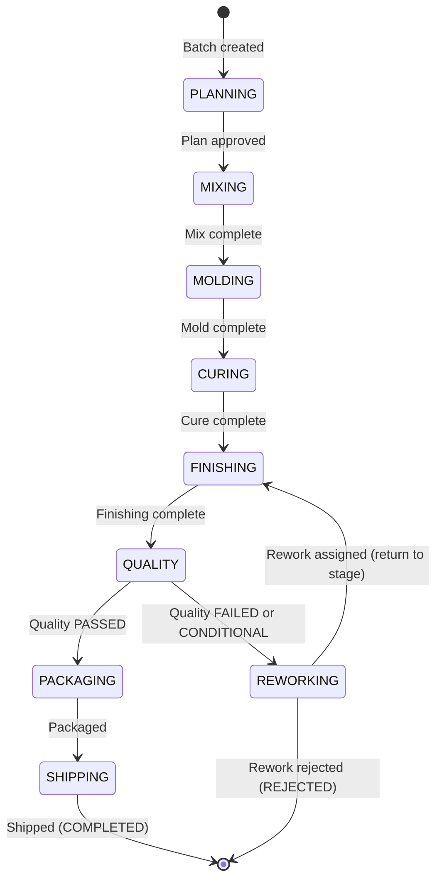
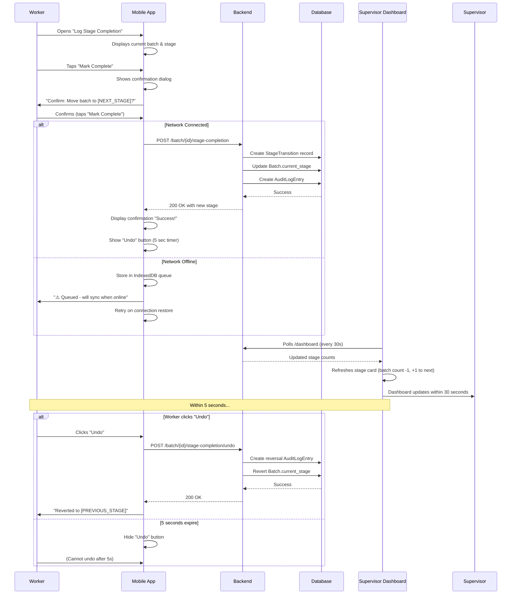
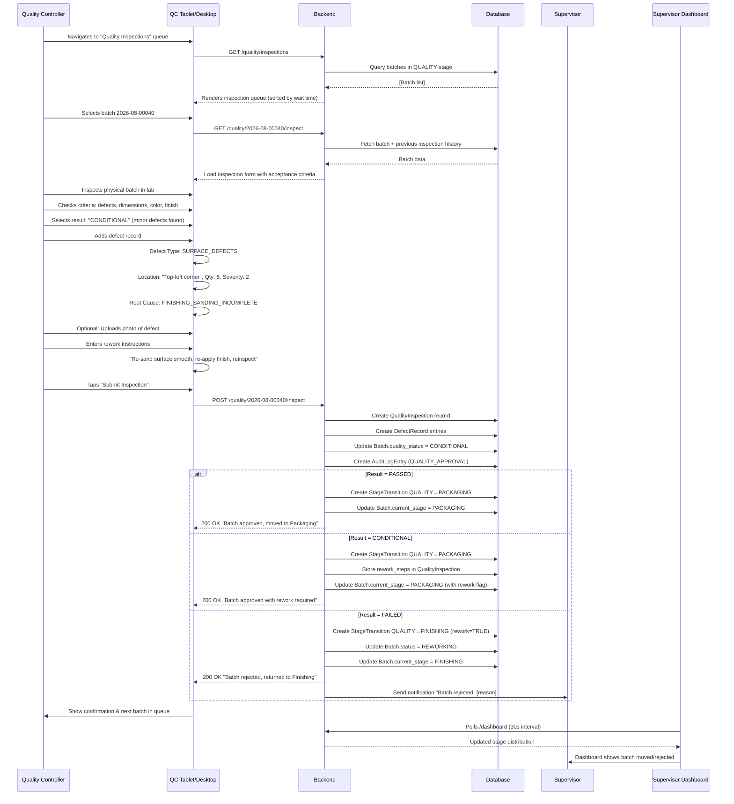
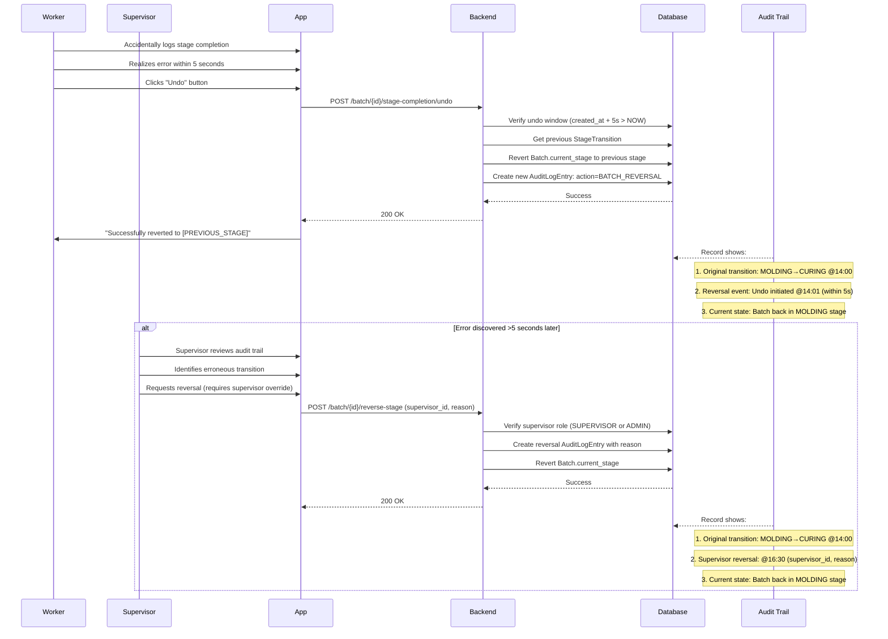
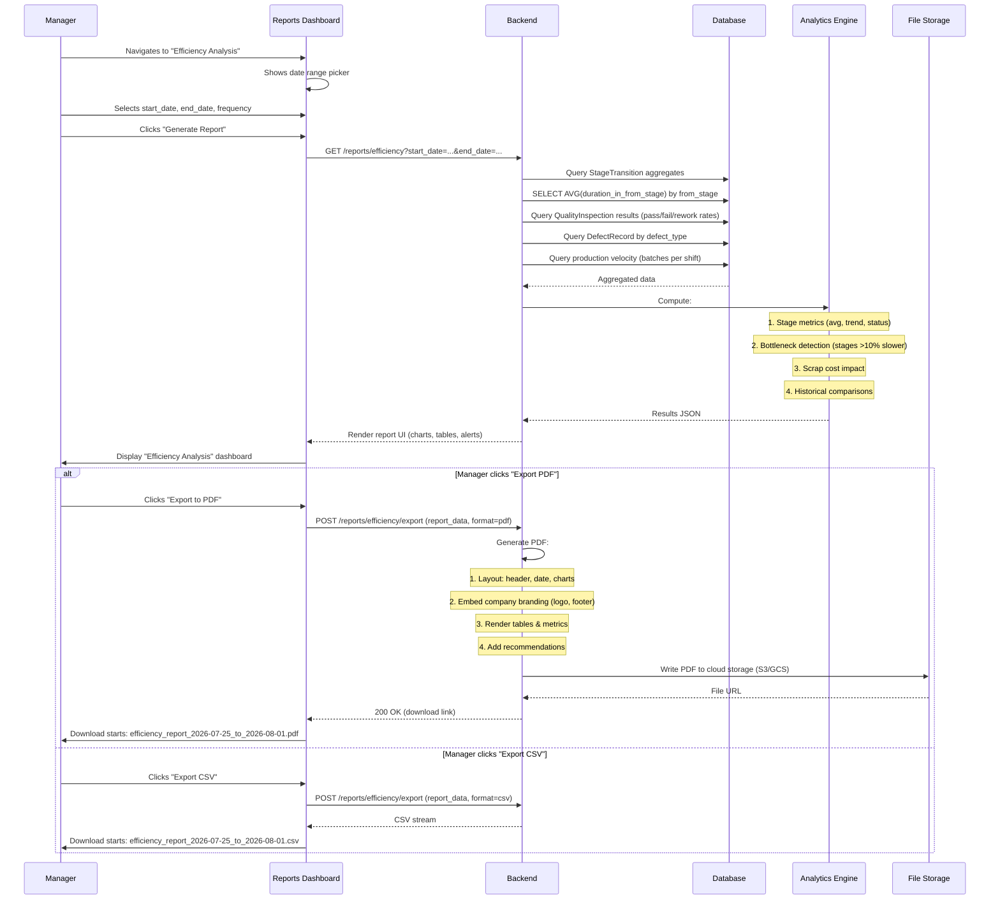
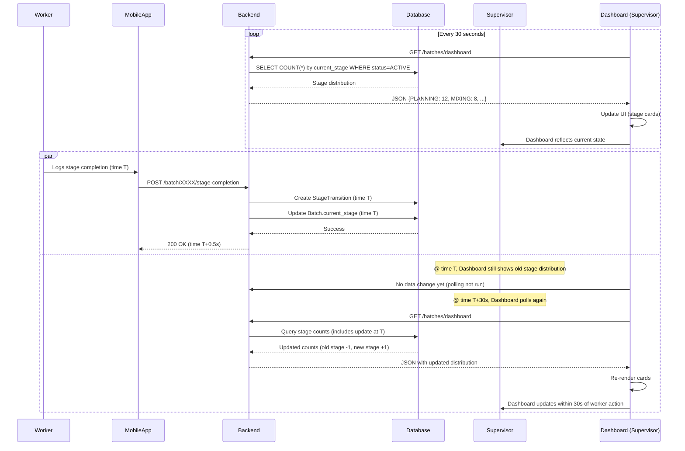
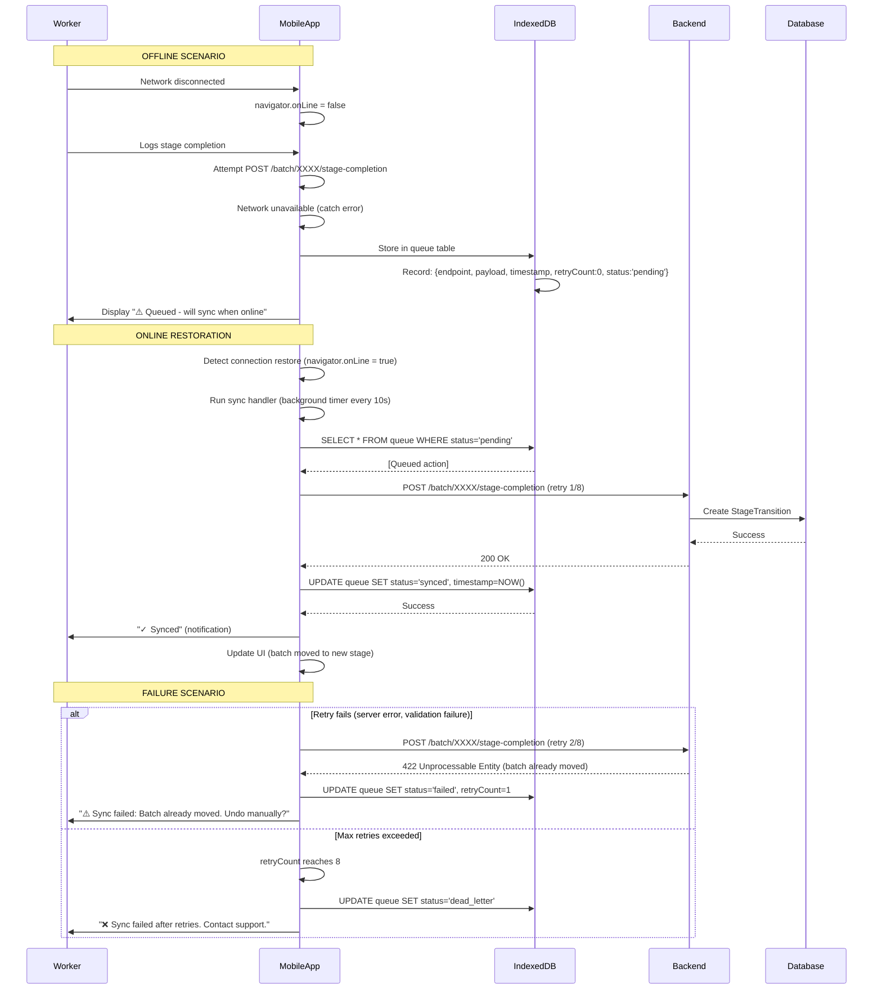
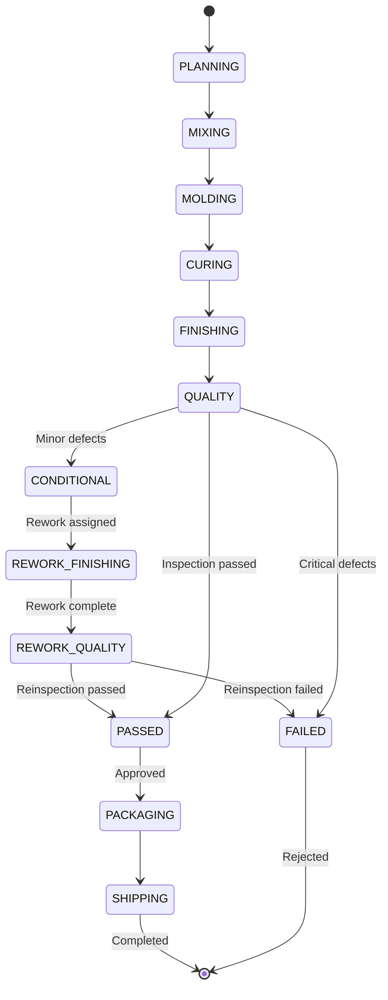

# Manufacturing Workflow Diagrams

**Version**: 1.0.0 | **Format**: Mermaid Sequence & State Diagrams

---

## 1. Batch Lifecycle State Diagram

**State Descriptions**:
- **PLANNING**: Batch order created, materials assigned, production scheduled. Duration: 2-3 hours.
- **MIXING**: Raw materials mixed according to recipe. Quality check on mixture. Duration: 1-2 hours.
- **MOLDING**: Mixture molded into tile forms in molds. Mold type and parameters recorded. Duration: 4-6 hours.
- **CURING**: Tiles cure in controlled temperature/humidity environment. Duration: 18-36 hours (longest stage).
- **FINISHING**: Surface finishing applied (sanding, sealing, etc.). Duration: 3-5 hours.
- **QUALITY**: Quality inspector examines batch, records pass/fail/conditional. Duration: 30-60 minutes.
- **PACKAGING**: Approved batch packaged for shipment. Duration: 1-2 hours.
- **SHIPPING**: Batch shipped to customer. Duration: ≤1 hour (handoff to carrier).
- **REWORKING**: Batch returned from Quality for corrections. Can loop back to any previous stage.
- **REJECTED**: Batch permanently failed quality; production ends.

---

## 2. Worker Stage Completion Workflow

**Key Points**:
1. Worker operates primarily on mobile; minimal network latency acceptable
2. Confirmation required to prevent accidental completions
3. Undo window: 5 seconds only (data integrity concern if too long)
4. Offline support: Queuing in IndexedDB, sync when connection restored
5. Dashboard updates within 30 seconds via polling (satisfies real-time requirement)
6. Reversal creates new audit event (original event not edited, immutability preserved)

---

## 3. Quality Inspection Workflow

**Key Workflows**:
1. **PASSED**: Batch advances to Packaging automatically
2. **CONDITIONAL**: Batch advances to Packaging with rework notes included (for customer/rework team)
3. **FAILED**: Batch returns to Finishing stage; supervisor notified for rework decision

---

## 4. Batch Reversal (Error Correction)

**Immutability Guarantee**:
- Original StageTransition record never edited or deleted
- Reversals create new AuditLogEntry records
- Complete history preserved for compliance/investigation
- Supervisor reversals require explicit override (not automated)

---

## 5. Report Generation & Export

---

## 6. Real-Time Dashboard Update Flow

**Timeline**:
- T+0: Worker logs completion
- T+0.5s: Backend confirms to mobile (worker sees success)
- T+30s: Supervisor dashboard refreshes, shows batch moved
- T+30s-60s: Next dashboard refresh (depends on polling cycle)

**Key Point**: 30-second update window meets specification. Real-time push (WebSocket) not required.

---

## 7. Offline → Online Sync Flow

**Sync Strategy**:
- Exponential backoff: 1s, 2s, 4s, max 8 retries
- Idempotent requests (same batch_id + timestamp = same transition)
- Failed requests moved to dead-letter queue for manual review

---

## 8. Rework Cycle

**Rework Transitions** (immutable events):
1. `QUALITY → FINISHING` (is_rework=TRUE) – Batch returns for corrections
2. Worker completes rework in Finishing stage
3. `FINISHING → QUALITY` (is_rework=TRUE) – Reinspection
4. Quality controller reinspects (reinspection_count incremented)
5. If PASSED: `QUALITY → PACKAGING` (no rework flag)
6. If FAILED: `QUALITY → REJECTED` (status=REJECTED, production ends)

**Audit Trail**:
- Original FINISHING → QUALITY transition: recorded as-is
- Quality rejected (CONDITIONAL): creates QUALITY_APPROVAL entry
- Rework assigned: creates reversal entry (QUALITY → FINISHING, is_rework=TRUE)
- Rework completion: creates new STAGE_TRANSITION entry
- Reinspection: creates new QUALITY_INSPECTION entry with is_reinspection=TRUE

